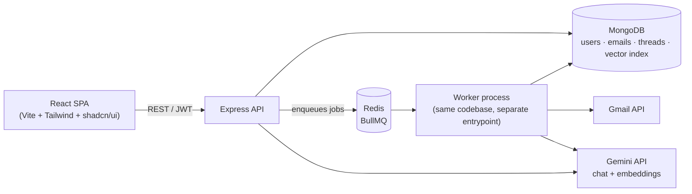

# AI Mail Assistant

**A production-grade AI email assistant SaaS.** Connect Gmail, get every email automatically summarized, categorized, and prioritized by AI, then search or ask questions across your whole inbox in natural language using retrieval-augmented generation.

[](https://github.com/bipin-griffith/all-in-one-mail-app/actions/workflows/ci.yml)


---

## What it does

- **Connects to Gmail** via OAuth2 and syncs inbox, sent, promotions, social, and drafts — incrementally, without duplicates.
- **Analyzes every new email automatically**: a one-shot Gemini call produces a summary, category (jobs/shopping/finance/bills/travel/…), priority, and suggested action.
- **Answers questions about your inbox** — "who rejected me?", "show Amazon invoices this month" — via semantic search (MongoDB Atlas Vector Search) feeding a RAG chat endpoint.
- **Surfaces eight focused dashboards**: jobs, shopping, finance, daily/monthly volume, top senders, unread, and high-priority emails.
- **Runs jobs asynchronously** (BullMQ + Redis) so the API never blocks on Gmail or Gemini — the frontend polls until a job completes.
- **Ships production-ready**: Docker multi-stage builds, GitHub Actions CI/CD, structured logging, Prometheus metrics, rate limiting, and an EC2 + S3/CloudFront deployment path.

## Architecture



The API never calls Gmail or Gemini inline in a request — it enqueues a job and returns immediately; the worker does the slow work and the frontend polls for the result. Full write-up: [`docs/ARCHITECTURE.md`](docs/ARCHITECTURE.md).

## Tech stack

| Layer | Choices |
|---|---|
| Frontend | React 18, TypeScript (strict), Vite, Tailwind CSS, shadcn/ui, TanStack Query |
| Backend | Node.js, Express, TypeScript (strict), Zod validation |
| Data | MongoDB + Mongoose, Atlas Vector Search (semantic search / RAG) |
| Jobs | BullMQ + Redis (email sync, AI processing, rate-limited AI workers) |
| AI | Gemini (`@google/genai`) — chat completion + embeddings |
| Auth | Google OAuth2 (Gmail), JWT access tokens + session-based refresh rotation |
| Infra | Docker, GitHub Actions CI/CD, Nginx, PM2, AWS (EC2, S3/CloudFront, Secrets Manager, CloudWatch) |
| Testing | Jest + `mongodb-memory-server` (server), Vitest (client) |

## Project structure

```
.
├── client/            # React + TS + Vite + Tailwind + shadcn/ui SPA
├── server/            # Express + TS API and BullMQ worker (same codebase, two entrypoints)
├── docs/              # Architecture, database, coding standards, security, API reference
├── nginx/             # Reverse proxy config for the EC2 host (production)
├── scripts/           # Deployment scripts (EC2 setup, SSL, secrets, S3/CloudFront)
├── .github/workflows/ # CI/CD
├── docker-compose.yml       # Local dev: mongo, redis, server, worker, client
└── docker-compose.prod.yml  # Production: server, worker, redis (frontend is on S3/CloudFront)
```

## Quick start

Requires Node.js ≥20, Docker (for MongoDB + Redis), and API credentials for Google OAuth + Gemini (both have free tiers — see below).

```bash
git clone https://github.com/bipin-griffith/all-in-one-mail-app.git
cd all-in-one-mail-app
npm install

cp server/.env.example server/.env
cp client/.env.example client/.env
# fill in GOOGLE_CLIENT_ID/SECRET and GEMINI_API_KEY in server/.env — see below

docker compose up -d mongo redis   # infra only
npm run dev                        # runs server + client concurrently
```

Or fully containerized: `docker compose up --build`. Once running, open http://localhost:5173.

### Getting API keys (both free)

| Variable | Where to get it |
|---|---|
| `GOOGLE_CLIENT_ID` / `GOOGLE_CLIENT_SECRET` | [Google Cloud Console](https://console.cloud.google.com/) → enable the Gmail API → OAuth consent screen → OAuth client ID (Web application) |
| `GEMINI_API_KEY` | [Google AI Studio](https://aistudio.google.com/apikey) — free tier, no billing/credit card required |

## Scripts

| Command | What it does |
|---|---|
| `npm run dev` | Runs the API and client concurrently (needs `docker compose up -d mongo redis` first) |
| `npm run dev:server` / `npm run dev:client` | Runs just one side |
| `cd server && npm run dev:worker` | Runs the BullMQ worker (required for Gmail sync + AI processing to actually happen) |
| `npm run build` | Production build of both workspaces |
| `npm test` | Server test suite (Jest + `mongodb-memory-server`) |
| `npm run lint` | Lint both workspaces |
| `npm run format` | Prettier, whole repo |

## Documentation

| Doc | Covers |
|---|---|
| [`docs/ARCHITECTURE.md`](docs/ARCHITECTURE.md) | System design, request/job lifecycles |
| [`docs/DATABASE.md`](docs/DATABASE.md) | Collections, indexes, design decisions |
| [`docs/API.md`](docs/API.md) | Endpoint reference, response envelope |
| [`docs/AUTH_AND_GMAIL.md`](docs/AUTH_AND_GMAIL.md) | Auth (sessions, JWT rotation) and Gmail sync design |
| [`docs/AI_PIPELINE.md`](docs/AI_PIPELINE.md) | Automatic per-email AI processing pipeline |
| [`docs/RAG_AND_DASHBOARDS.md`](docs/RAG_AND_DASHBOARDS.md) | Semantic search / RAG chat and dashboards |
| [`docs/CODING_STANDARDS.md`](docs/CODING_STANDARDS.md) | Layering, naming, testing conventions |
| [`docs/SECURITY.md`](docs/SECURITY.md) | AuthN/Z, secrets, transport, dependency hygiene |
| [`docs/OPERATIONS.md`](docs/OPERATIONS.md) | Health checks, metrics, caching, logging |
| [`docs/DEPLOYMENT.md`](docs/DEPLOYMENT.md) | EC2 + S3/CloudFront + Atlas setup, CI/CD, rollback |
| [`docs/INFRASTRUCTURE.md`](docs/INFRASTRUCTURE.md) | Architecture diagrams |
| [`docs/PRODUCTION_READINESS.md`](docs/PRODUCTION_READINESS.md) | What's verified, what isn't, before you launch |

## CI/CD

Every push runs lint, typecheck, tests, and a Docker build check for both workspaces ([`.github/workflows/ci.yml`](.github/workflows/ci.yml)). On success on `main`, [`cd.yml`](.github/workflows/cd.yml) builds and pushes the server image, deploys it to EC2 over SSH, and syncs the frontend build to S3/CloudFront.
