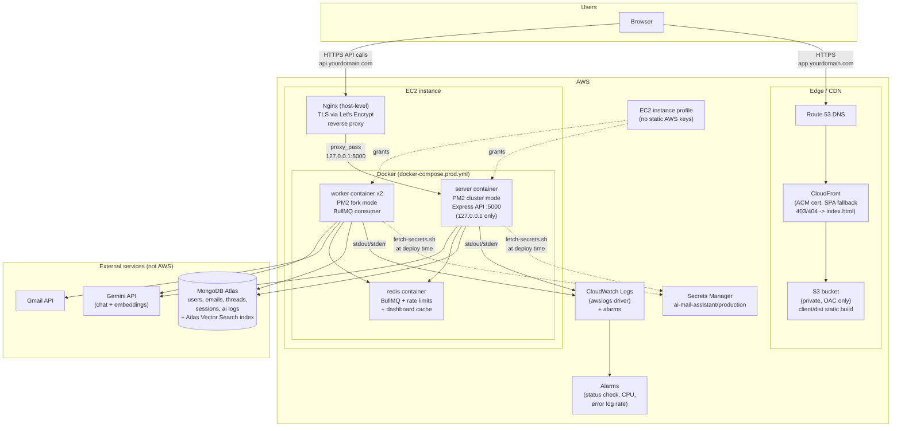
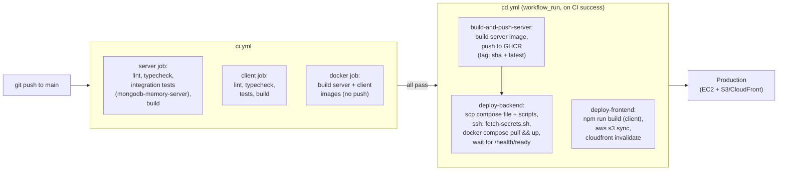

# Infrastructure Diagrams

Rendered as Mermaid — GitHub renders these natively in this file, no image
export needed (and they won't go stale the way a hand-drawn PNG would).

## AWS production architecture

Notes on choices this diagram makes visible:
- The API container binds to `127.0.0.1:5000` — reachable only through
  Nginx, never directly, even if a security group were misconfigured.
- `/metrics` is deliberately absent from any arrow reaching Nginx or the
  internet — see `docs/OPERATIONS.md`.
- MongoDB Atlas, Gmail, and Gemini are all external to AWS — nothing about
  this architecture requires them to be in AWS, and the app never assumes
  a specific Atlas network topology beyond a valid connection string.

## CI/CD pipeline

Notes:
- `deploy-frontend` does not depend on `build-and-push-server` — a
  frontend-only change deploys without waiting on an EC2 SSH round-trip.
- The `docker` job in CI exists because both Dockerfiles silently failed to
  build for a period (npm-workspaces lockfile scoping bug — see
  `server/Dockerfile`'s comment); a broken Docker build is now a required
  check on every PR, not something only discovered during an actual deploy.
